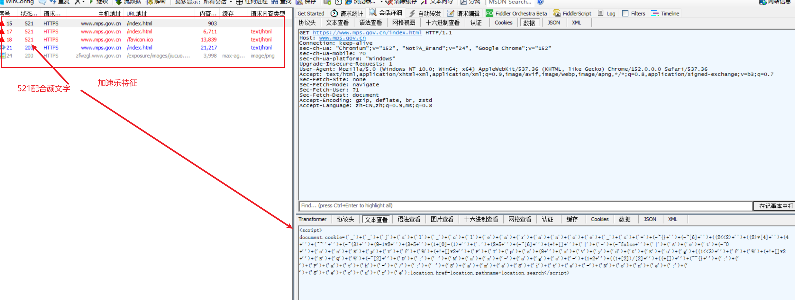
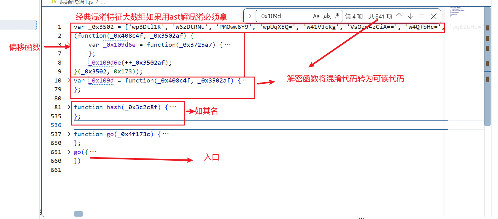
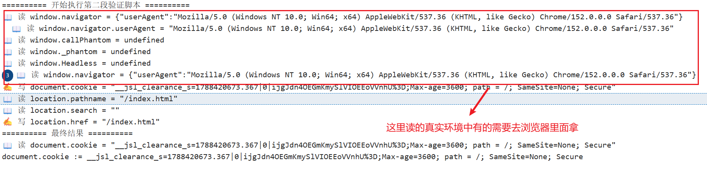
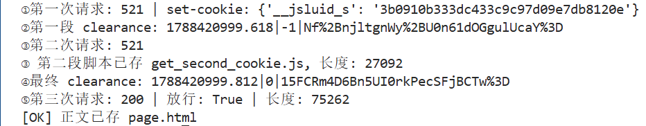

# 中华人民共和国公安部 加速乐（JSL）验证解析

> 目标：`https://www.mps.gov.cn/index.html`，绕过加速乐三道验证，拿到 200 正文。
> 核心思路：**不读代码、不改代码、只补环境** —— 把服务器下发的验证脚本原样扔进 Node 执行，补齐它需要的浏览器环境，然后从结果里取 cookie。

## 一、抓包分析



### 请求流程（三次验证，共四轮请求）

| 轮次 | 请求 | 响应 | 说明 |
|---|---|---|---|
| ① | 无 cookie 首次请求 | 521 + `__jsluid_s` + 挑战1脚本 | 服务器下发用户 uid（Set-Cookie）+ 第一段验证脚本 |
| ② | 带 `\|-1\|` cookie | 521 + 挑战2脚本 | 第二段 md5 挑战脚本（30KB 混淆） |
| ③ | 带 `\|0\|` cookie | 200 正文 | 放行，返回真实页面 |

### Cookie 结构（关键）

```
__jsl_clearance_s = 1788420628.461 | 0 | kSD4xVu14WJs%2FR9yQUpe57ATjmc%3D
                    └─────┬──────┘ └┬┘ └──────────────┬──────────────┘
                        时间戳     状态标志          签名(base64)
```

- `|-1|`：第一段脚本（弱验证）产物
- `|0|`：第二段脚本（强验证/md5挑战）产物——**`|0|` 段是服务器在 `go({bts:[...]})` 参数里下发的，不是自己编的**
- 每次请求时间戳不同，参数动态下发，**不能缓存旧 cookie**（Max-age 仅 3600s）

## 二、解混淆

### 2.1 第一段脚本：颜文字混淆，直接 eval

这段基本是明文 + 字符拼接混淆，结构为：

```js
document.cookie=('_')+('_')+('j')+('s')... ; // 拼接出 __jsl_clearance_s=...
location.href=location.pathname+location.search;  // 触发浏览器刷新
```

解法：丢入 eval 执行，模拟 `document` / `location` 后直接取 `document.cookie`。

### 2.2 后两次请求：结果格式基本一致，提供两种解法



#### 2.2.1 解法一：插桩（Proxy 监控）——推荐

> 思路：用 `Proxy` 把模拟环境包一层监控壳，脚本读写任何属性都会被打印，
> 从而**看清脚本到底干了什么**（写了什么 cookie、读了哪些环境变量），缺啥补啥。



附上插桩代码（仅供参考，非唯一解）：

```js
function watch(obj, name = 'obj', depth = 0) {
    const indent = '  '.repeat(depth);
    const seen = new WeakSet(); // 防止循环引用死循环

    function wrap(value, key) {
        if (value && typeof value === 'object' && !seen.has(value)) {
            seen.add(value);
            return watch(value, `${name}.${key}`, depth + 1);
        }
        if (typeof value === 'function') {
            return function (...args) {
                const r = value.apply(this, args);
                console.log(`${indent}▶ ${name}.${key}(${args.map(a => JSON.stringify(a)).join(', ')}) →`, JSON.stringify(r));
                return r;
            };
        }
        return value;
    }
    const handler = {
        get(t, prop) {
            const v = t[prop];
            console.log(`${indent}📖 读 ${name}.${String(prop)} =`, typeof v === 'function' ? '<function>' : JSON.stringify(v));
            return wrap(v, prop);
        },
        set(t, prop, value) {
            console.log(`${indent}✍️ 写 ${name}.${String(prop)} =`, JSON.stringify(value));
            t[prop] = value;
            return true;
        },
        has(t, prop) {
            console.log(`${indent}❓ in ${name}.${String(prop)}`);
            return prop in t;
        },
    };
    return new Proxy(obj, handler);
}
```

**插桩结果解读**（缺啥补啥，这里不再复述，关键点如下）：

```
📖 读 window.navigator.userAgent = "Mozilla/5.0 ...Chrome/152..."  ← 环境检测，需伪造浏览器UA
📖 读 window.callPhantom / _phantom / Headless = undefined          ← 反爬虫特征检测
✍️ 写 document.cookie = "__jsl_clearance_s=...|0|...;"             ← 脚本算出的最终 cookie
✍️ 写 location.href = "/index.html"                                  ← 触发刷新
```

**需要补的环境对象：**

| 脚本要用 | 补什么 | 原因 |
|---|---|---|
| `document.cookie` | `{cookie:''}` | 接收写入的 cookie |
| `location.pathname/search/href` | 模拟对象 | 脚本靠它触发"刷新"逻辑 |
| `window.navigator.userAgent` | 浏览器 UA | 骗过环境检测（不补就是 `Node.js/24`，脚本直接 return） |
| `alert` | 打桩 | 失败分支会调，不补就崩 |
| `setTimeout` | Node 自带 | 脚本延迟 1500ms 写 cookie，等它写完再取 |

> ⚠️ **window 不要直接 `watch(global)`**：Node 的 `process`/`Buffer`/`require` 会暴露给环境检测。
> 正确做法是给 window 一个**伪装过的内容**（只放 navigator 等浏览器属性），三个模拟对象互相独立。

#### 2.2.2 解法二：AST 解混淆

> 思路：用 Babel（`@babel/parser` + `@babel/traverse` + `@babel/generator` + `@babel/types`）把混淆代码解析成 AST，
> 按结构特征捕捉关键片段，最后用 `generate` 重新输出接近明文的代码。
> 依赖安装：`npm install @babel/parser @babel/traverse @babel/generator @babel/types`

**混淆代码结构识别**（obfuscator 三件套）：

```
① var _0x39e0 = ['fcKWw6fDmQ==', ...]        ← 长字符串数组（259 个元素）
② (function(...){ push/shift 循环 })(_0x39e0, 0x1ed)  ← 洗牌自执行函数（打乱数组顺序，次数写死故结果确定）
③ var _0x510c = function(...){ ... }          ← 解码函数（读数组 + 缓存 + base64/RC4 解密，函数体 6 条语句）
   之后所有字符串都用 _0x510c('0x16','S9ax') 这种形式间接引用
```

**Step 1：按结构特征提取三段代码**（先数组 → 再洗牌 → 再解码函数，顺序由依赖决定）

```js
traverse(ast, {
    VariableDeclaration(path) {                       // 捕数组 + 解码函数
        const init = path.node.declarations[0].init;
        if (type.isArrayExpression(init) && init.elements.length > 50) {
            parts.array = generate(path.node).code;   // 长数组
        } else if (type.isFunctionExpression(init) && init.body.body.length === 6) {
            DecodingCodeName = path.node.declarations[0].id.name;
            parts.decode = generate(path.node).code;  // 解码函数
        }
    }
});
traverse(ast, {
    ExpressionStatement(path) {                       // 捕洗牌 IIFE
        const callee = path.node.expression && path.node.expression.callee;
        if (type.isFunctionExpression(callee) && callee.body.body.length === 2) {
            parts.shuffle = generate(path.node).code;
        }
    }
});
```

**Step 2：拼成可执行环境文件**（顺序：数组 → 洗牌 → 解码函数，再 `module.exports` 导出）

```js
const code = [parts.array, parts.shuffle, parts.decode,
              "module.exports = " + DecodingCodeName + ";"].join('\n');
fs.writeFileSync("./decode_env.js", code, "utf-8");

delete require.cache[require.resolve("./decode_env.js")];  // 清缓存，加载刚写的新版
const get_value = require("./decode_env.js");              // 得到可调用的解码函数
```

**Step 3：遍历替换调用点**：`CallExpression` 里 `callee.name === DecodingCodeName` 且两个参数都是字符串字面量时，当场求值并 `replaceWith` 成字符串节点

```js
traverse(ast, {
    CallExpression(path) {
        const node = path.node;
        if (node.callee.name === DecodingCodeName && node.arguments.length === 2) {
            const [a1, a2] = node.arguments;
            if (type.isStringLiteral(a1) && type.isStringLiteral(a2)) {
                path.replaceWith(type.stringLiteral(get_value(a1.value, a2.value)));
            }
        }
    }
});
```

**Step 4：合并字符串 `+` 二元拼接**（`('_')+('_')+...` 这类合并成整串）

```js
traverse(ast, {
    BinaryExpression(path) {
        const node = path.node;
        if (type.isStringLiteral(node.left) && type.isStringLiteral(node.right)
            && node.operator === "+") {
            path.replaceWith(type.stringLiteral(node.left.value + node.right.value));
        }
    }
});
```

**最终输出**：`fs.writeFileSync("结果.js", generate(ast).code, "utf-8")`

**实战效果**（对比 `ob.js` 27KB → `结果.js` 23.8KB）：
**PS** 结果中还有一些二元运算没有匹配到如果想要匹配到可以写一个递归去依次解决二元表达式，这里解混淆只是为了让代码好看对于最终解决还需看源码的复杂度，还是插桩补环境好用点
```
剩余解码调用 _0x510c(: 0   ← 268 处调用全部还原为真实字符串
剩余字符串拼接: 0          ← 表达式合并完毕
```

<!-- 此处待补充 AST 解混淆实战截图 -->

## 三、最终结果



---

## 免责声明

> 本网站为**中华人民共和国公安部官方网站**（www.mps.gov.cn），受法律保护。
>
> 本文档仅用于**技术学习与研究**，内容包括对该网站前端 JS 验证机制（加速乐）的逆向分析，目的是理解 Web 安全防护原理与 JavaScript 混淆、反爬虫技术的实现方式。
>
> **严禁**将本文档内容用于任何非法用途，包括但不限于：对政府网站进行恶意攻击、批量抓取、干扰网站正常运行、破坏网络安全等行为。请读者遵守《中华人民共和国网络安全法》《中华人民共和国数据安全法》及相关法律法规，合法合规使用技术知识。
>
> 本文档不构成任何攻击性工具或教程，作者不对使用本文档内容产生的任何后果负责。